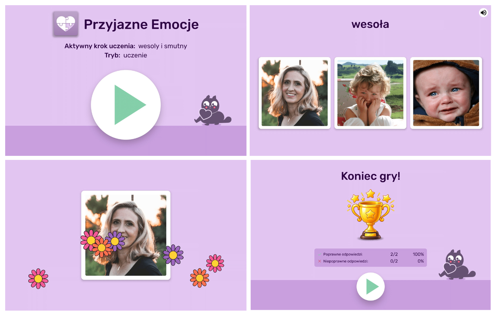
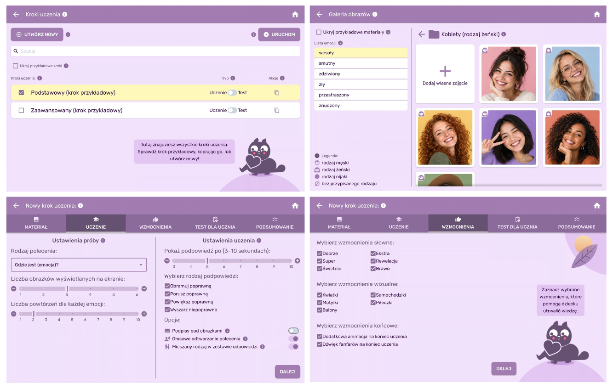

# Friendly Emotions

The application is part of the [Friendly Apps](http://autyzm.eti.pg.gda.pl) project. This is a set of educational applications aimed at supporting behavioral therapy of children with autism.

**Friendly Emotions** (*Przyjazne Emocje*) teaches **emotion recognition**: the child is shown photographs of people, animals or emojis expressing an emotion and taps the image that matches the emotion named on the screen and spoken aloud.



A separate **therapist app**, bundled in the same APK, lets therapists manage teaching materials (images grouped by emotion) and configure learning steps — difficulty, number of images shown, hints, reinforcement and test mode — without any manual file editing.



Both apps share a local Room database and run fully offline.

## Getting started

- **JDK**: 17
- **Kotlin**: 2.1.20, **AGP**: 8.9.1, **Gradle**: 8.11.1

```bash
./gradlew assembleDebug
```

Installing the debug build adds two launcher icons: one for the child app, one for therapist settings.

## Project structure

Clean Architecture / MVVM with Jetpack Compose, Material 3, Hilt and Room, split across `:app`, `:domain`, `:data`, `:feature:child`, `:feature:therapist` and `:core:ui`.

Full specs, domain model, ADRs and the implementation roadmap live in [`docs/target/`](docs/target/); reference documentation of the sibling Friendly Words app lives in [`docs/reference/friendly-words/`](docs/reference/friendly-words/).

## Testing & code style

```bash
./gradlew test         # unit tests
./gradlew ktlintCheck  # lint
```

## Release

### Local build

1. Place your keystore file (e.g. `friendlyemotions_upload.jks`) in the `app/` directory.
2. Create a `keystore.properties` file in the project root:
   ```properties
   KEYSTORE_PASSWORD=<your-keystore-password>
   KEY_PASSWORD=<your-key-password>
   KEY_ALIAS=<your-key-alias>
   KEYSTORE_PATH=friendlyemotions_upload.jks
   ```
3. Build the signed release bundle:
   ```bash
   ./gradlew bundleRelease
   ```
   The AAB will be at `app/build/outputs/bundle/release/app-release.aab`.

### GitHub Actions

The repository includes a manually-triggered workflow (`.github/workflows/deploy.yml`) that builds a signed release AAB.

**Setup (one-time):**

Add four secrets in the repository settings (Settings > Secrets and variables > Actions). These may already be configured — check before adding:

| Secret | Value |
|---|---|
| `KEYSTORE_BASE64` | Base64-encoded keystore (`base64 < app/friendlyemotions_upload.jks \| pbcopy`) |
| `KEYSTORE_PASSWORD` | Keystore password |
| `KEY_ALIAS` | Key alias |
| `KEY_PASSWORD` | Key password |

**Running the workflow:**

1. Go to Actions > "Create bundle artifact" > Run workflow.
2. Enter the version numbers (major, minor, patch).
3. The workflow builds the AAB and uploads it as an artifact you can download from the workflow run page.

## Authors

Developed at the Gdańsk University of Technology as part of the [Friendly Apps](http://autyzm.eti.pg.gda.pl) initiative supporting autism therapy.

## License

Except as otherwise noted, this software is licensed under the [GNU General Public License, v3](https://www.gnu.org/licenses/gpl-3.0.txt).
